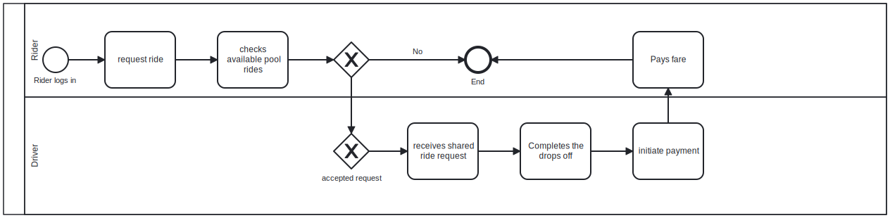

Names: Ndacyayisenga Shema Arsene

Student ID: 25195

Group: F

## Project Statement
This project aims at reduce the cost of public transportation via Taxi/Cab by having people who are headed in the same direction
spilt cost among the passengers

## Project Overview

-This ride-sharing system is designed to provide an affordable and efficient transportation solution for people in Rwanda. Similar to Uber Pool, the platform enables multiple passengers to share a single ride if they are traveling in the same direction.
 The system includes functionalities for user registration (passengers and drivers), vehicle management, ride creation, seat booking, payment processing, and ride fare estimation. It ensures data integrity and operational control through PL/SQL procedures, functions, and triggers. The system also includes auditing features to monitor restricted data changes on weekdays and public holidays.
 All database logic and operations are implemented using Oracle Database with PL/SQL, simulating a real-world backend for a ride-sharing application tailored to local needs.

## Project Objectives

- To provide an affordable ride-sharing solution tailored to the Rwandan market
- To enable passengers to book shared rides and split costs based on location and timing
- To optimize vehicle usage and increase driver earnings through pooled rides
- To implement secure, efficient backend logic using Oracle PL/SQL
- To track and audit user activity for accountability and transparency

## Advantages of the System

- **Affordability**: Passengers save money by sharing rides with others traveling the same route
- **Efficiency**: Drivers utilize their time and vehicle capacity better
- **Security & Control**: Triggers and auditing protect data from unauthorized or inappropriate changes
- **Automation**: PL/SQL procedures automate ride booking, fare estimation, and restrictions
- **Scalability**: The system can easily expand to include more features or serve other cities

## Technologies Used

- **Oracle Database 21c** – for relational data storage and management
- **PL/SQL** – to implement backend business logic including:
  - Procedures and functions for booking and fare estimation
  - Triggers for enforcing business rules and auditing
  - Cursors for fetching and displaying ride data
- **SQL*Plus** – for command-line interaction with the Oracle database
- **Draw.io** and **BPMN.io** – for creating ER diagrams and BPMN models
- **GitHub** – for version control and report submission

## Entity Relationship Diagram (ERD)


 ## Core Entities in the System:
## Users
Stores information about all users — drivers and passengers.
Columns: **user_id**, **name**, **email**, **phone**, **user_type**, **password_hash**

## Vehicle
Vehicles are registered and linked to drivers.
Columns: **vehicle_id**, **driver_id**, **plate_number**, **model**, **capacity**

## Ride
Represents a scheduled ride by a driver.
Columns: **ride_id**, **driver_id**, **origin**, **destination**, **departure_time**, **status**

## Booking
Each booking links a passenger to a specific ride.
Columns: **booking_id**, **ride_id**, **passenger_id**, **seat_count**, **booking_time**

## Payment
Stores payment details for each booking.
Columns: **payment_id**, **booking_id**, **amount**, **payment_method**, **status**

##  Entity Relationships and Multiplicity

| Relationship Description                            | From Entity | To Entity | Multiplicity     |
|-----------------------------------------------------|-------------|-----------|------------------|
| A driver can own multiple vehicles                 | Users       | Vehicle   | 1 to many (1:N)  |
| Each ride is created by one driver                 | Users       | Ride      | 1 to many (1:N)  |
| Each ride can have multiple passenger bookings     | Ride        | Booking   | 1 to many (1:N)  |
| Each passenger can make multiple bookings          | Users       | Booking   | 1 to many (1:N)  |
| Each booking has exactly one payment               | Booking     | Payment   | 1 to 1 (1:1)     |

## Explanation

-One **user** can be either a **driver** or a **passenger**, distinguished by the user_type column.

-A **driver** can register many vehicles, but each vehicle belongs to one driver.

-A **ride** is always offered by one driver, but can be booked by many passengers.

-A **passenger** can make **multiple bookings** over time.

-Each **booking** results in a **single payment** (1:1 relationship).




## BPMN Process Overview
The BPMN diagram models the process of booking a shared ride in the ride-sharing system. It involves three main participants:

## Lanes:
**Passenger**: Initiates the ride search and booking
**Driver**: Creates and manages available rides
**System**: Executes logic such as fare estimation, booking validation, and auditing

## Key Process Flow:
-**Passenger** searches for available rides
-**System** fetches all scheduled rides using a **cursor**
-**Passenger** selects a ride and books it via the **book_ride** procedure
-**System** calculates **fare** using the **estimate_fare** function
-**System** validates the **booking** with a trigger that blocks DML on weekends and holidays
-If allowed, **booking** is confirmed and payment is processed
-**Audit log** is updated with the result (allowed or denied)
-**Driver** receives **ride assignments** from the system

## Function Price Estimation


```sql
CREATE OR REPLACE FUNCTION estimate_fare (
    p_origin      IN VARCHAR2,
    p_destination IN VARCHAR2,
    p_seat_count  IN NUMBER
) RETURN NUMBER
IS
    v_distance NUMBER;
    v_fare_per_km CONSTANT NUMBER := 1500;
    v_total_fare NUMBER;
BEGIN
    SELECT distance_km INTO v_distance
    FROM city_distance
    WHERE origin = p_origin AND destination = p_destination;

    v_total_fare := v_distance * v_fare_per_km * p_seat_count;
    RETURN v_total_fare;

EXCEPTION
    WHEN NO_DATA_FOUND THEN
        RETURN -1;
END;
/
```
## Explanation
This function estimates the total fare for a ride. It retrieves the distance between two Kigali locations from the city_distance table, multiplies it by the number of seats and a fixed base fare of 1,500 RWF/km, and returns the total amount. If the origin/destination pair isn’t found, it returns -1.

## Procedure For Booking rides


```sql
CREATE OR REPLACE PROCEDURE book_ride (
    p_ride_id      IN NUMBER,
    p_passenger_id IN NUMBER,
    p_seat_count   IN NUMBER
)
IS
BEGIN
    INSERT INTO booking (ride_id, passenger_id, seat_count, booking_time)
    VALUES (p_ride_id, p_passenger_id, p_seat_count, SYSTIMESTAMP);

    COMMIT;
EXCEPTION
    WHEN OTHERS THEN
        ROLLBACK;
END;
/

```
## Explanation

This procedure inserts a new row into the booking table to represent a seat reservation by a passenger for a given ride. It records the current timestamp automatically and commits the change. If an error occurs (e.g. invalid ride or user ID), it rolls back the transaction to maintain data integrity.

## Trigger For restrictions


```sql
CREATE OR REPLACE TRIGGER trg_restrict_dml
BEFORE INSERT OR UPDATE OR DELETE ON booking
FOR EACH ROW
DECLARE
    v_day VARCHAR2(10);
    v_today DATE := TRUNC(SYSDATE);
    v_holiday NUMBER;
BEGIN
    SELECT TO_CHAR(SYSDATE, 'DY', 'NLS_DATE_LANGUAGE = ENGLISH') INTO v_day FROM dual;

    SELECT COUNT(*) INTO v_holiday
    FROM holiday_dates
    WHERE holiday_date = v_today;

    IF v_day IN ('SAT', 'SUN') OR v_holiday > 0 THEN
        INSERT INTO audit_log (user_id, operation, object_name, action_time, status)
        VALUES (USERENV('SESSIONID'), 'BLOCKED', 'BOOKING', SYSTIMESTAMP, 'DENIED');

        RAISE_APPLICATION_ERROR(-20001, 'DML operations are blocked on weekends and public holidays.');
    ELSE
        INSERT INTO audit_log (user_id, operation, object_name, action_time, status)
        VALUES (
            USERENV('SESSIONID'),
            CASE
                WHEN INSERTING THEN 'INSERT'
                WHEN UPDATING THEN 'UPDATE'
                WHEN DELETING THEN 'DELETE'
            END,
            'BOOKING',
            SYSTIMESTAMP,
            'ALLOWED'
        );
    END IF;
END;
/
```

## Explanation

This trigger activates whenever someone tries to insert, update, or delete data in the booking table. It checks the current day of the week and the holiday_dates table. If today is a weekend (Saturday or Sunday) or a public holiday, the action is blocked and logged in audit_log. Otherwise, it allows the action and logs it as "ALLOWED".

## Cursor For Displaying Scheduled rides


```sql
SET SERVEROUTPUT ON;

DECLARE
    CURSOR c_rides IS
        SELECT ride_id, origin, destination, departure_time
        FROM ride
        WHERE status = 'Scheduled';

    v_ride_id      ride.ride_id%TYPE;
    v_origin       ride.origin%TYPE;
    v_destination  ride.destination%TYPE;
    v_departure    ride.departure_time%TYPE;
BEGIN
    OPEN c_rides;
    LOOP
        FETCH c_rides INTO v_ride_id, v_origin, v_destination, v_departure;
        EXIT WHEN c_rides%NOTFOUND;
        DBMS_OUTPUT.PUT_LINE('Ride: ' || v_ride_id || ' | From ' || v_origin || ' to ' || v_destination || ' at ' || v_departure);
    END LOOP;
    CLOSE c_rides;
END;
/

```
## Explanation
This anonymous PL/SQL block uses a cursor to loop through all active rides (those with status = 'Scheduled'). It fetches each ride and prints details such as origin, destination, and departure time using DBMS_OUTPUT.PUT_LINE. This is useful for admins to review ride availability.


